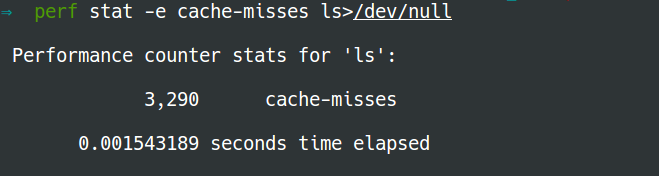

## Use perf to measure cache misses and TLB misses

### Installation

Install [*perf*](https://perf.wiki.kernel.org/index.php/Main_Page):

Note that if you use *perf* on department **linux9** servers, there is no need to install.

```bash
$ sudo apt-get install linux-tools-common linux-tools-4.2.0-27-generic linux-cloud-tools-4.2.0-27-generic
```

### Usage

To measure cache miss:

```bash
$ perf stat -e cache-misses <command>
```

To collect TLB miss:

```bash
$ perf stat -e dTLB-load-misses,iTLB-load-misses <command>
```

For example:

```bash
$ perf stat -e cache-misses ls>/dev/null
```



```bash
$ perf stat -e dTLB-load-misses,iTLB-load-misses ls>/dev/null
```


