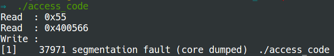
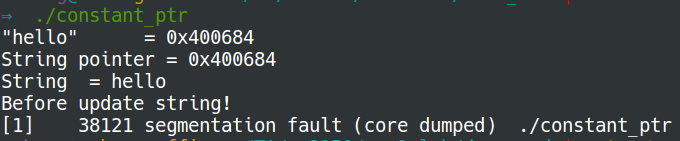

# Write to read-only memory
Code and constant variables are both read-only. Any change to the code or the
constant variables during the runtime can incur segmentation faults.

### Write to code
The following piece of code results in a segmentation fault, because it tries
to change the code.
```C
#include <stdio.h>
int main(void) {
    void *ptr = main;
    unsigned char c = *((unsigned char *) ptr); //cast ptr to sth readable
    printf("Read  : 0x%x\n", c); // %x, Unsigned hexadecimal integer
    printf("Read  : %p\n", ptr); // %p, address stored in pointer(point address)
    printf("Write : \n");
    *((unsigned char *) ptr) = 0xff; //segmentation fault
    printf("done\n");
    return 0;
}
```


### Write to constant variable
This sample code writes to a constant pointer.
```C
#include <stdio.h>

int main(void) {
    char *string  = "hello"; //a pointer to a constant
    printf("\"hello\"      = %p\n", "hello");
    printf("String pointer = %p\n", string);
    printf("String  = %s\n", string);
    printf("Before update string!\n");
    string[4] = '\0'; //segmentation fault
    printf("After update string!\n");
    printf("Go to %s\n", string);
    return 0;
}
```

