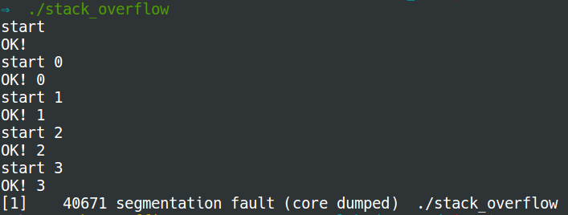

# Stack overflow 

A stack overflow results in a segmentation fault. The most common cause of
stack overflow is excessively deep or infinite recursion. Now try the code
below:
```C
#include <stdio.h>
#include <string.h>
#include <unistd.h>
void recursion(int i) {
	char a[40 * 1024];
	printf("start %d\n", i);
	memset(a, 0, sizeof(a));
	printf("OK! %d\n", i);
	recursion(i+1);
}
int main(int argc, char **argv) {
	char a[8000 * 1024]; // remaining is 192 * 1024
	printf("start\n");
	memset(a, 0, sizeof(a));
	printf("OK!\n");
	recursion(0);
	return 0;
}
```
Here is the output:

What happened?
- Find out the maximum size of the stack in kilobyte (KB)
  ```bash
  $ ulimit -s
  8192
  ```
- So the maximum size of the stack is **8192 KB** = 8192 \* 1024 bytes.
- In the `main` function, we use 8000 \* 1024 bytes which remains 192 \* 1024
  bytes.
- Four calls to the `recursion` function use 160 \* 1024 bytes.
- So the fifth call to the `recursion` function exceeds the maximum size of the
  stack and triggers the stack overflow.
