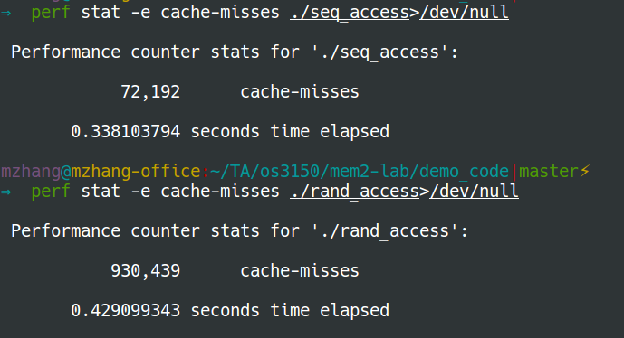
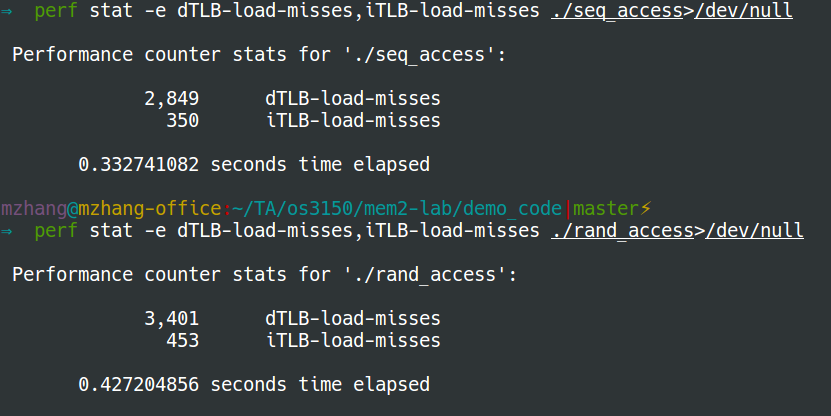

## Sequential access and random access

### Sequential access
The following code `seq_access.c` accesses memory sequentially.
```C
#include <stdio.h>
#include <stdlib.h>
#include <string.h>

size_t max_size = 1ULL<<24; // 2^24
int access_size = 1000000;

int main(void) {
    srand((int)123);
    // Generate an array
    int *tmp = (int *)malloc(sizeof(int) * max_size);
    for (size_t i = 0; i < max_size; i++) {
        tmp[i] = rand()%10;
    }
    // Generate a list of elements to access sequentially
    size_t *access = (size_t *)malloc(sizeof(size_t) * access_size);
    int access_begin = 0; // we will access tmp from the beginning
    for (int i = 0; i < access_size; i++) {
        access[i] = access_begin++;
    }
    // Read tmp sequentially
    for (int i = 0; i < access_size; i++) {
        printf("num[%zu]=%d\n", access[i], tmp[access[i]]);
    }
    free(tmp);
    return 0;
}
```
### Random access
The following code `rand_access.c` tries to access memory randomly.
```C
#include <stdio.h>
#include <stdlib.h>
#include <string.h>

size_t max_size = 1ULL<<24; // 2^24
int access_size = 1000000;

int main(void) {
    srand((int)123);
    // Generate an array
    int *tmp = (int *)malloc(sizeof(int) * max_size);
    for (size_t i = 0; i < max_size; i++) {
        tmp[i] = rand() % 10;
    }
    // Generate a list of elements to access randomly
    size_t *access = (size_t *)malloc(sizeof(size_t) * access_size);
    for (int i = 0; i < access_size; i++) {
        access[i] = rand() * 1024 % max_size;
    }
    // Read tmp randomly
    for (int i = 0; i < access_size; i++) {
        printf("num[%zu]=%d\n", access[i], tmp[access[i]]);
    }
    free(tmp);
    return 0;
}
```
## Difference between sequential access and random access

### Cache misses
We use the following commands to measure cache misses:
```bash
$ perf stat -e cache-misses ./seq_access>/dev/null
$ perf stat -e cache-misses ./rand_access>/dev/null
```

### TLB misses
We collect TLB misses using the following commands:
```bash
$ perf stat -e dTLB-load-misses,iTLB-load-misses ./seq_access>/dev/null
$ perf stat -e dTLB-load-misses,iTLB-load-misses ./rand_access>/dev/null
```

