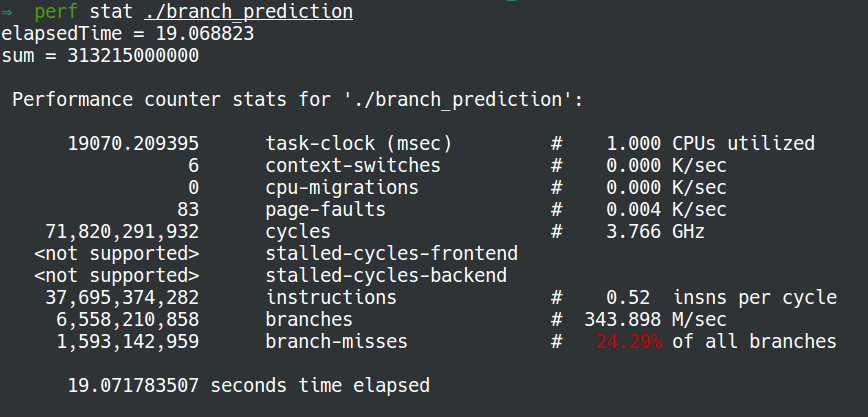
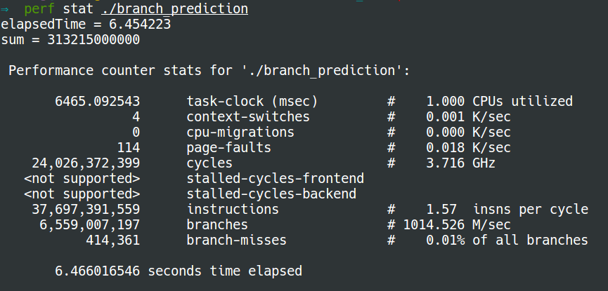

# Branch prediction

### Branch prediction
First let us look into the following program to get to know **branch
prediction**:
```C
#include <time.h>
#include <stdio.h>
#include <stdlib.h>

int cmpfunc (const void * a, const void * b) {
       return ( *(int*)a - *(int*)b );
}

int main() {
    // Generate data
    const unsigned arraySize = 32768;
    int data[arraySize];
    srand((int)123);

    for (unsigned c = 0; c < arraySize; ++c)
        data[c] = rand() % 256;
    
    // !!! With this, the next loop runs faster
    /* qsort(data, arraySize, sizeof(int), cmpfunc); */
    
    // Test
    clock_t start = clock();
    long long sum = 0;

    for (unsigned i = 0; i < 100000; ++i) {
        // Primary loop
        for (unsigned c = 0; c < arraySize; ++c) {
            if (data[c] >= 128)
                sum += data[c];
        }
    }
    double elapsedTime = ((double)(clock() - start)) / CLOCKS_PER_SEC;

    printf("elapsedTime = %f\n", elapsedTime);
    printf("sum = %llu\n", sum);
}
```
We use `perf` to check the number of branch misses:
* **without sorting**: 
* **with sorting**: 

**Why sorting makes difference?**

* At the processor level, it considers an `if`-statement as a branch
    instruction.  The processor sees a branch and has no idea which way it will
    go.  In computers, the processor doesn't know which direction a branch will
    go until the last moment. So it guesses which direction the branch will go!
    * If it guessed right, continue executing.
    * If it guessed wrong, flush the pipeline and roll back to the branch. Then
        it can restart down the other path.


* If it guesses right every time, the execution will never have to stop.  If it
    guesses wrong too often, the computer spends a lot of time stalling,
    rolling back, and restarting. This is **branch prediction**.

* To minimize the number of wrong guess times, the processor looks at the past
    history.  If "going left" 99% of the time, then it guesses left. If it
    alternates, then it alternates its guesses. If it goes one way every 3
    times, it guesses the same. In other words, it tries to identify a pattern
    and follow it. This is more or less how **branch predictors** work.

* Most applications have well-behaved branches. So modern branch predictors
    will typically achieve >90% hit rates. But when faced with unpredictable
    branches with no recognizable patterns, branch predictors are virtually
    useless. This why sorting makes much less branch predictions.


### Optimization
To optimize the above program, we can remove `if` using the following lines,
which are not easy to understand:
```C
            int t = (data[c] - 128) >> 31;
            sum += ~t & data[c];
```
**How this code works?**
* If `data[c] >= 128`, then `t = 0`, `~t & data[c] = data[c]`.
* If `data[c] < 128`, then `t = -1`, `~t & data[c] = 0`.

Therefore, the above two lines can work correctly as same as `if`. Please refer
to the references if you would like to know the operators (`>>`, `~`, `&`) in
detail.

Now the number of branch misses with sorting is almost equal to that without
sorting:
* **without sorting**: 
* **with sorting**: 


**References**:
* [Wikipedia: Branch predictor](https://en.wikipedia.org/wiki/Branch_predictor)
* [Stackoverflow: branch
    prediction](http://stackoverflow.com/questions/11227809/why-is-it-faster-to-process-a-sorted-array-than-an-unsorted-array)
* [C library function - qsort()](https://www.tutorialspoint.com/c_standard_library/c_function_qsort.htm)
* [C operators](https://www.tutorialspoint.com/cprogramming/c_operators.htm)
