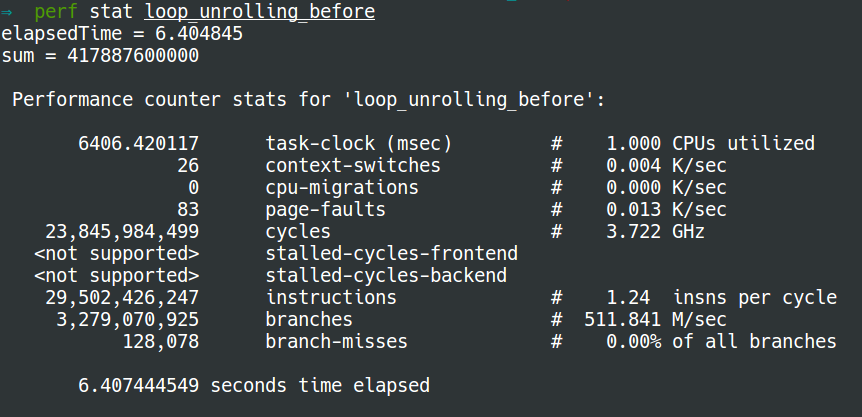
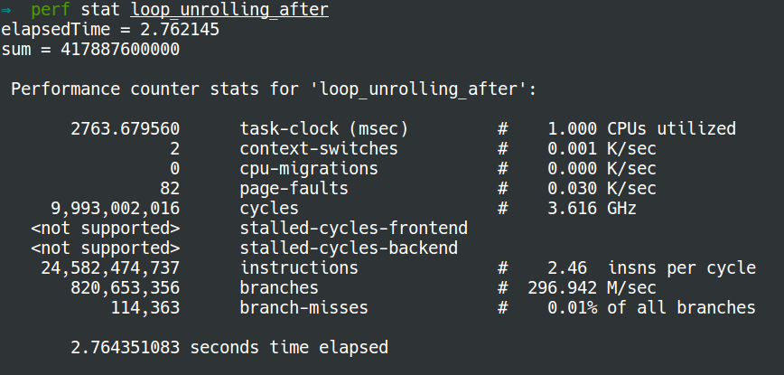

# Loop unrolling

To understand **loop unrolling**, we will look into the next
two pieces of code.

### Normal loop

```C
#include <time.h>
#include <stdio.h>
#include <stdlib.h>

int main() {
    // Generate data
    const unsigned arraySize = 16384; //32768
    int data[arraySize];
    srand((int)123);

    for (unsigned c = 0; c < arraySize; ++c)
        data[c] = rand() % 256;
    
    // Test
    clock_t start = clock();
    long long sum = 0;

    for (unsigned i = 0; i < 100000; ++i) {
        // Primary loop
        for (unsigned c = 0; c < arraySize; ++c) {
                sum += data[c];
        }
    }

    double elapsedTime = ((double)(clock() - start)) / CLOCKS_PER_SEC;

    printf("elapsedTime = %f\n", elapsedTime);
    printf("sum = %llu\n", sum);
}
```


### After loop unrolling

Now we do loop unrolling on the primary `for` loop. The modified program is as
following:
```C
#include <time.h>
#include <stdio.h>
#include <stdlib.h>

int main() {
    // Generate data
    const unsigned arraySize = 16384; //32768
    int data[arraySize];
    srand((int)123);

    for (unsigned c = 0; c < arraySize; ++c)
        data[c] = rand() % 256;
    
    // Test
    clock_t start = clock();
    long long sum = 0;
    long long sum1 = 0, sum2=0, sum3=0, sum4=0;

    for (unsigned i = 0; i < 100000; ++i) {
        // Primary loop
        for (unsigned c = 0; c < arraySize; c+=4) {
                sum1 += data[c+0];
                sum2 += data[c+1];
                sum3 += data[c+2];
                sum4 += data[c+3];
        }
    }
    sum = sum1 + sum2 + sum3 + sum4; 

    double elapsedTime = ((double)(clock() - start)) / CLOCKS_PER_SEC;

    printf("elapsedTime = %f\n", elapsedTime);
    printf("sum = %llu\n", sum);
}
```
#### Output
The output of **normal loop** using `perf stat` is: 
<br></br>
The output **after loop unrolling** using `perf stat` is: 


#### Explanation
* As a result of loop unrolling, the new program has to make only 25% of loops
    that the normal way has. Afterwards, only 25% of the jumps and conditional
    branches need to be taken. A potentially significant decrease in the loop
    administration overhead.
* Moreover, the dependency chain of the arguments in the program of normal loop
    is very short. If you get a stall because you have a cache-miss on the
    data-array the cpu cannot do anything but to wait. However, after loop
    unrolling, there are still three other dependency chains that don't depend
    on the stall if you get a cache miss or other stall in one calculation.
    This is why the latter runs faster with much less branches.


<br></br>
**References**:
* [Loop unrolling on wikipedia](https://en.wikipedia.org/wiki/Loop_unrolling)
* [When, if ever, is loop unrolling still
    useful?](http://stackoverflow.com/questions/2349211/when-if-ever-is-loop-unrolling-still-useful)
